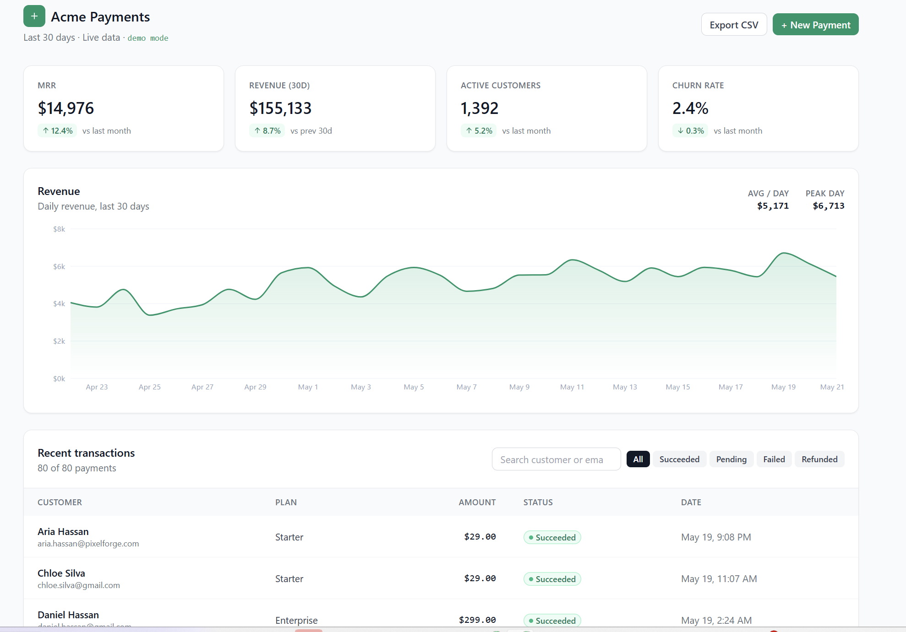

# Payment Dashboard

Modern SaaS-style payment analytics dashboard. KPI cards, revenue charts, transactions table with status filtering, all powered by mock Stripe-style data.

**Stack:** React 18 · Next.js 14 · TypeScript · Tailwind CSS · Recharts · date-fns

[**Live Demo →**](https://payment-dashboard-vert.vercel.app)



---

## What this is

A drop-in dashboard layout you can wire to a real Stripe (or any payments) API in under an hour. Demonstrates KPI tracking, interactive charts, filterable tables, and responsive design — the full vocabulary a SaaS founder expects.

## Features

- **4 KPI cards** — MRR, 30-day revenue, active customers, churn rate. Each shows month-over-month delta with up/down indicator.
- **Interactive revenue chart** — 30-day area chart powered by Recharts. Average and peak-day callouts.
- **Filterable transactions table** — Status badges (Succeeded, Pending, Failed, Refunded). Customer search across the table.
- **CSV export** — Transactions exportable to CSV with one click.
- **Demo mode indicator** — Subtle badge so users know mock data is shown.
- **Locale-aware formatting** — Numbers and dates use `Intl.NumberFormat` / `date-fns` for international clients.
- **Mobile responsive** — Works from phone to ultra-wide desktop.

---

## Quick start

```bash
npm install
npm run dev
```

Open [http://localhost:3000](http://localhost:3000).

No environment variables required — the dashboard uses fully mock data.

---

## Wiring to a real API

The mock data lives in `lib/mock-data.ts`. Replace those exports with fetches from your real backend (Stripe API, internal payments service, etc.). Component contracts are typed in `lib/types.ts`.

```ts
// Before (mock)
import { transactions, kpis } from "@/lib/mock-data"

// After (real)
const transactions = await fetch("/api/transactions").then(r => r.json())
const kpis = await fetch("/api/kpis").then(r => r.json())
```

The components consume the same shape — no UI changes needed.

---

## Project structure

```
payment-dashboard/
├── app/
│   ├── globals.css
│   ├── layout.tsx
│   └── page.tsx               # Renders <Dashboard />
├── components/
│   ├── dashboard.tsx          # Main layout
│   ├── kpi-card.tsx           # KPI card with delta indicator
│   ├── revenue-chart.tsx      # Recharts area chart
│   ├── status-badge.tsx       # Color-coded status pill
│   └── transactions-table.tsx # Filterable table with search
├── lib/
│   ├── mock-data.ts           # Generated transactions + KPI values
│   ├── types.ts               # Transaction, KPI types
│   └── utils.ts               # cn() helper
└── docs/
    └── screenshot.png         # README image
```

---

## Design decisions

- **Recharts over Chart.js** — Better TypeScript story and pure-React rendering (no canvas refs to manage).
- **Semantic color tokens for status badges** — `success`, `warning`, `danger`, `info` so theme changes propagate consistently.
- **Status badge component reused everywhere** — Single source of truth for status presentation.
- **`Intl.NumberFormat` for currency/numbers** — International clients see their locale's formatting without extra work.
- **No backend** — Pure frontend showcase. Wire to your own API in `lib/mock-data.ts`.

---

## Customization

### Change the brand color

Edit `tailwind.config.ts` → `theme.extend.colors`. Update KPI card and chart fill in `revenue-chart.tsx`.

### Add more KPI cards

Add a new entry to `kpis` in `lib/mock-data.ts`. The grid auto-flows. To change from 4 to N cards, update the grid columns in `dashboard.tsx`.

### Customize the chart

The chart accepts standard Recharts props. To change to a bar chart, swap `<AreaChart>` for `<BarChart>` in `revenue-chart.tsx`.

---

## Deploy

```bash
npm install -g vercel
vercel --prod
```

No environment variables needed for the mock version. Deploys in ~30 seconds.

---

## License

MIT — see `LICENSE`.

---

## Built by

[@leninug](https://github.com/leninug) — full-stack developer focused on React, TypeScript, and modern web stacks. Available for [freelance work on Fiverr](https://www.fiverr.com/lnin88).
